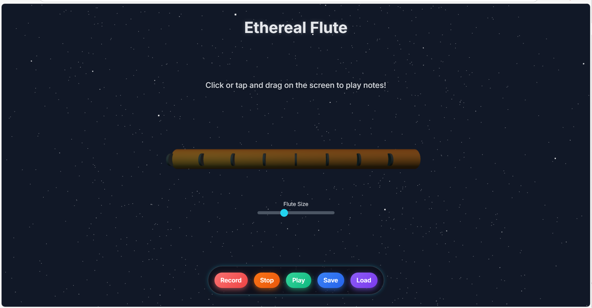

# 🎶 3D Flute Player App  

A simple **web-based flute player** where users can play notes, adjust flute size, record performances, play them back, and save/load recordings.  

## 🚀 Features  
- 😎 Play flute sounds directly in the browser  
- 📏 Adjust **flute size** with a slider (affects pitch)  
- 🎙️ **Record** your performance  
- ▶️ **Play back** recordings  
- 💾 **Save & Load** recordings locally  
- 📱 **Responsive design** for mobile and desktop

## 📱 Mobile Support  
- Buttons are optimized for touch input.  
- The flute size bar is placed for better mobile usability.  

## 🖼️ Demo Screenshot  

